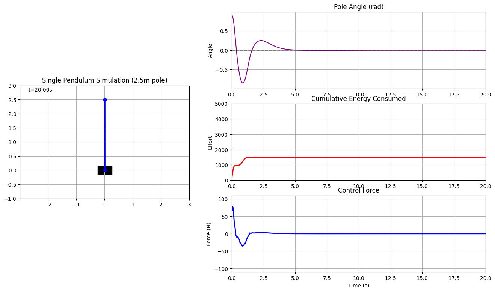
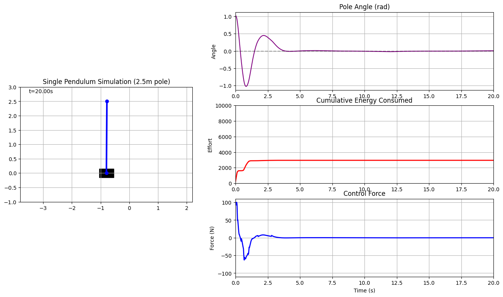

# Inverted Pendulum Control Optimization with ShinkaEvolve

<p align="center">
<i>Automated discovery of high-performance control strategies using LLM-driven evolutionary programming</i>
</p>

---

## 📖 Project Overview

This project uses the [ShinkaEvolve](https://github.com/SakanaAI/shinka) framework (an LLM-driven evolutionary programming library developed by Sakana AI) to automatically optimize single inverted pendulum control algorithms through multi-generational evolution. The experiments demonstrate **LLM agents' automated innovation capabilities in complex control problems**, with the evolved controllers significantly outperforming the initial design across multiple metrics.

### Key Achievements
- ✅ **270+ generations of evolutionary optimization**, achieving 27-57% performance improvement
- ✅ **Multi-model collaboration**: 9 state-of-the-art LLMs including DeepSeek, Claude, Gemini, and Qwen participating in evolution
- ✅ **Fully automated**: Complete pipeline from code generation, evaluation, selection to optimization executed by LLM agents
- ✅ **Two-round experimental validation**: From incremental LQR refinement to paradigm-shifting innovation

---

## 🎯 Control Problem Definition

### Physical System
**Single Inverted Pendulum**: A long rod balanced on a horizontally movable cart.

**System Parameters** (high-difficulty configuration):
- 🔹 Cart mass: 1.0 kg
- 🔹 Pole mass: 0.35 kg (heavy with large inertia)
- 🔹 Pole length: 2.5 m (extremely long, highly unstable)
- 🔹 Friction coefficients:
  - Cart friction: 0.35 (high energy dissipation)
  - Joint friction: 0.25 (significant damping)
- 🔹 Initial angle:
  - Experiment 1: 0.4 rad (~23°)
  - Experiment 2: 1.02 rad (~58°) - **Extreme challenge**
- 🔹 Simulation Sample Time: 20ms

### Control Objectives
**Multi-Objective Optimization (MOP)**:
1. ⚡ **Fast stabilization**: Minimize stabilization time
2. 🎯 **High-precision balancing**: Pole vertical (θ → 0), cart centered (x → 0)
3. 💚 **Energy-efficient control**: Minimize energy consumption
4. 🚫 **Avoid failure**: |θ| < 1.5 rad, |x| < 10 m

### Scoring System
**Maximum ~7300 points**, including:
- **Base stability**: ~500-800 points (angle, position, velocity errors)
- **Time efficiency bonus**: up to +3000 points (exponential reward, faster = higher)
- **Energy efficiency bonus**: up to +2500 points (lower energy consumption)
- **Success bonus**: up to +800 points (high-precision stability)

---

## 🧬 Experimental Design

### Experiment 1: `results_pendulum_liter_1`
**Incremental evolution around LQR algorithm**

**Strategy**:
- Initial program: Adaptive controller based on LQR (Linear Quadratic Regulator)
- Evolution direction: Parameter tuning, feature engineering, friction-aware modeling
- Generations: 180
- Initial angle: 0.4 rad (~23°)

**Key innovations** (automatically discovered during evolution):
1. **Friction-aware state-space model**: Precisely derived A/B matrices incorporating viscous friction
2. **Optimized Q/R weights**: Fine-tuned LQR weights emphasizing angular stabilization
3. **Adaptive gain scheduling**: Smooth tanh-based transitions for position and velocity gains
4. **Mid-swing angular damping**: Derivative-based damping during high-energy transition phase (0.3-0.7 rad)
5. **Predictive momentum compensation**: Estimates angular acceleration to anticipate destabilizing momentum
6. **Cross-coupled Q-matrix**: State-dependent off-diagonal terms for enhanced coordination

**Final performance**:
- Initial score: 3195 points
- Best score: **5016 points** (Gen 170)
- Improvement: **+57%**

---

### Experiment 2: `results_pendulum_liter_2`
**Aggressive innovation breaking traditional frameworks**

**Strategy adjustments**:
- 🔥 **Banned traditional terminology**: Explicitly prohibited terms like "LQR", "Riccati", "Q matrix" in prompts to encourage fresh thinking
- 🚀 **Encouraged paradigm shifts**: Required LLMs to rethink from perspectives like physical intuition, biological inspiration, and phase-based control
- ⚡ **Increased difficulty**: Initial angle increased from 0.4 rad to 1.02 rad (~58°) - **near the physical limit**
- 📈 **Larger innovation space**: max_tokens increased from 4096 to 16384

> **🎯 Experimental significance**: Despite banning LQR terminology, the evolved controller still discovered mathematically similar principles through first-principles reasoning, demonstrating LLM agents' ability to **rediscover fundamental control theory autonomously**. This validates the robustness of optimal control principles while showcasing creative implementation strategies.

**Key innovations** (autonomously proposed by LLMs):
1. **Three-phase adaptive control** (Phase-Adaptive Control):
   - Emergency Phase (|θ| > 0.8): Aggressive swing-up + energy pumping
   - Recovery Phase (0.3 < |θ| ≤ 0.8): Predictive damping + adaptive gains
   - Balancing Phase (|θ| ≤ 0.3): Precision control + enhanced integral action
2. **Energy-efficient damping**: Intelligently identifies motion direction, applies damping only when moving away from vertical
3. **Enhanced position correction**: Adaptive position gain + velocity-dependent damping
4. **Direction-sensitive integral bounds**: Dynamically adjusts integral limits based on displacement direction

**Final performance**:
- Initial score: 3931 points
- Best score: **4871 points** (Gen 90)
- Improvement: **+24%**
- Successfully handles 58° initial angle - **a task that would cause both the initial LQR controller and Experiment 1's best controller to fail completely**

---

## 📊 "Path to Best" Evolution Analysis

### Experiment 1: Conservative LQR Refinement
**Generational evolution visualization**:

```
Gen 0 → Gen 20 → Gen 26 → Gen 43 → Gen 93 → Gen 133 → Gen 148 → Gen 152 → Gen 162 → Gen 170
3195    3946     4432     4894     4920     4927      4934      4935      4920      5016 points
```

#### 🔹 Gen 0: `initial_program`
- **Score**: 3195.17
- **Description**: Basic LQR controller with hardcoded A/B matrices
- **Limitation**: Inaccurate linearization, suboptimal Q/R weights

#### 🔹 Gen 20: `friction_aware_lqr_model`
- **Score**: 3945.50 (+750.3) 🚀 **First major breakthrough**
- **Innovation**: Precisely derived friction-aware state-space matrices from nonlinear dynamics
- **Impact**: Corrected model mismatch, improved responsiveness

#### 🔹 Gen 26: `tune_lqr_weights_angular_priority`
- **Score**: 4431.51 (+486.0)
- **Optimization**: Increased theta weight to 40.0, reduced x weight to 4.0 for faster angular convergence

#### 🔹 Gen 43: `optimized_adaptive_lqr_with_tanh_scheduling`
- **Score**: 4893.84 (+462.3)
- **Innovation**: Smooth tanh-based gain scheduling replacing linear transitions
- **Refinement**: Blended position and velocity gains, increased Q[1]=42, Q[3]=3.0

#### 🔹 Gen 93: `multiplicative_gain_with_swing_assist`
- **Score**: 4920.15 (+26.3)
- **Key insight**: Switched from weighted blend to multiplicative gain combination
- **Addition**: Physics-informed swing-up assist for large angles (>0.8 rad)

#### 🔹 Gen 133: `crossover_with_integral_control`
- **Score**: 4926.67 (+6.5)
- **Innovation**: Introduced integral control with dual angle-velocity gating
- **Enhancement**: Enhanced damping (Q[3]=3.4), robust arctan2 angle normalization

#### 🔹 Gen 148: `simplified_integral_gating_with_optimal_damping`
- **Score**: 4933.93 (+7.3)
- **Refinement**: Reverted to simpler angle-only integral gating
- **Tuning**: Optimal damping Q[3]=3.2, faster cart centering

#### 🔹 Gen 152: `sharper_gain_transitions_and_velocity_gated_integral`
- **Score**: 4934.54 (+0.6)
- **Optimization**: Sharper tanh transitions (7.0/6.0 coefficients)
- **Addition**: Velocity-gated integral to prevent transient windup

#### 🔹 Gen 162: `adaptive_integral_lqr_hybrid`
- **Score**: 4920.84
- **Strategy**: Hybrid crossover combining optimal Q weights [4.5, 44.0, 0.6, 3.2] with sharpened gain transitions
- **Refinement**: Simplified angle-only integral gating (K_i=0.82) with tighter anti-windup bounds [-1.5, 1.5]

#### 🔹 Gen 170: `adaptive_cross_coupled_lqr_with_midswing_damping`
- **Score**: 5015.73 (+81.2) 🏆 **Best performance**
- **Innovations**: 
  1. State-dependent cross-coupling in Q-matrix (Q[1,3], Q[3,1] scale with angle)
  2. Mid-swing angular damping actively suppresses momentum in transition zone
  3. Predictive momentum compensation estimates angular acceleration
  4. Energy-aware integral scaling for faster cart centering

**Evolution characteristics**: This experiment demonstrates **incremental refinement** of the LQR framework. Each generation made small but systematic improvements—better physics modeling, optimized parameters, smarter gain scheduling. The evolution stayed within the LQR paradigm throughout, validating classical control theory while discovering creative enhancements.

---

### Experiment 2: Paradigm-Shifting Innovation

**Generational evolution visualization**:
```
Gen 0 → Gen 16 → Gen 22 → Gen 36 → Gen 47 → Gen 64 → Gen 80 → Gen 90
3931    3970     4636     4213     4233     4697     4467     4871 points
```

#### 🔹 Gen 0: `initial_program`
- **Score**: 3931.61
- **Description**: Initial LQR-based controller (starting from Experiment 1's refined baseline)
- **Features**: Adaptive cross-coupling, mid-swing damping, predictive compensation

#### 🔹 Gen 16: `physics_enhanced_prediction_and_damping`
- **Score**: 3970.15 (+38.5)
- **Innovations**: 
  1. Direction-aware mid-swing damping (senses pole's travel direction)
  2. High-fidelity predictive compensation incorporating control force, friction, centripetal terms

#### 🔹 Gen 22: `fix_integral_sign_and_damp_logic`
- **Score**: 4636.78 (+666.6) 🚀 **Critical breakthrough**
- **Fix**: Corrected integral term sign error (was causing positive feedback instead of negative)
- **Optimization**: Refined mid-swing damping to activate only when returning to vertical

#### 🔹 Gen 36-47: Exploratory phase
- **Score**: 4213 → 4233
- **Characteristic**: Temporary performance decline during exploration (typical of evolutionary search)

#### 🔹 Gen 64: `fix_integral_sign_and_position_centering`
- **Score**: 4697.90 (+464.1)
- **Optimizations**: 
  1. Re-corrected integral force sign (persistent issue)
  2. Enhanced position correction: lowered activation threshold, increased gain

#### 🔹 Gen 80: `emergency_phase_cart_damping`
- **Score**: 4467.48 (-230.4)
- **Attempt**: Added cart damping in emergency phase (short-term regression, later refined)

#### 🔹 Gen 90: `enhanced_integral_windup_and_position_control`
- **Score**: 4871.36 (+403.9) 🏆 **Best performance**
- **Innovations**: 
  1. **Direction-sensitive integral saturation**: Asymmetric windup limits preserve headroom for corrective action
  2. **Adaptive position correction gain**: Responds to both position and velocity errors
  3. Successfully stabilizes from 58° initial angle—a feat the initial controller cannot accomplish

**Evolution characteristics**: Despite the ban on LQR terminology, this experiment **converged to mathematically similar principles** through independent reasoning. The key difference lies in **implementation creativity**—phase-based control, direction-sensitive logic, and adaptive strategies. This demonstrates that optimal control principles are discoverable through first-principles thinking, while innovative implementations can enhance performance beyond traditional approaches.

---

## 📸 Visualization Results

### Experiment 1 Best Controller (Gen 170, Score: 5016)
<!-- Replace with actual image path -->


### Experiment 2 Best Controller (Gen 90, Score: 4871)
<!-- Replace with actual image path -->


> **💡 Interactive Visualization**: Run `viz_pendulum.ipynb` in Jupyter Notebook to see **real-time simulation animations** of the pendulum controllers in action. The notebook allows you to compare different controllers, adjust parameters, and visualize the evolution of control strategies across generations.

---

## 🛠️ Project Structure

```
.
├── initial.py                   # Initial controller implementation (LQR baseline)
├── evaluate.py                  # Performance evaluation and scoring system
├── run_evo.py                   # Evolution run configuration
├── test_performance.py          # Performance testing script
├── visualization_utils.py       # Visualization tools
├── viz_pendulum.ipynb          # Interactive visualization notebook (real-time simulation)
│
├── results_pendulum_liter_1/   # Experiment 1 results (180 gen, 23° initial)
│   ├── best/                   # Best program (Gen 170, 5016 points)
│   ├── gen_*/                  # Candidate programs per generation
│   ├── evolution_db.sqlite     # Evolution database
│   ├── experiment_config.yaml  # Experiment configuration
│   └── evolution_run.log       # Run log
│
└── results_pendulum_liter_2/   # Experiment 2 results (102 gen, 58° initial)
    ├── best/                   # Best program (Gen 90, 4871 points)
    ├── gen_*/                  # Candidate programs per generation
    ├── evolution_db.sqlite     # Evolution database
    └── experiment_config.yaml  # Experiment config (banned LQR terminology)
```

---

## 🚀 Quick Start

### 1. Environment Setup
```bash
# Install ShinkaEvolve
pip install shinka-evolve

# Install dependencies
pip install numpy scipy matplotlib jupyter
```

### 2. Test Initial Controller
```bash
python test_performance.py
```

### 3. Run Evolution Experiment
```bash
# Start evolution (requires LLM API keys configuration)
python run_evo.py
```

### 4. Visualize Results with Interactive Simulation
```bash
# Open Jupyter Notebook for real-time animation
jupyter notebook viz_pendulum.ipynb
```

---

## 📝 Code Example

### Best Controller Core Logic (Experiment 2 - Gen 90)
```python
def get_action(self, state):
    x, theta, dx, dtheta = state
    theta = ((theta + np.pi) % (2 * np.pi)) - np.pi
    
    # Three-phase determination
    if abs(theta) > 0.8:
        current_phase = "emergency"     # Emergency swing-up
    elif abs(theta) > 0.3:
        current_phase = "recovery"      # Recovery phase
    else:
        current_phase = "balancing"     # Precision balancing
    
    # Base force computation
    base_force = -self.K @ state_vec
    
    # Phase-adaptive gain scheduling
    if current_phase == "emergency":
        # High gain + energy pumping
        pos_gain = 1.0 + 0.8 * tanh(6.0 * (abs(theta) - 0.8))
        u_swing = 12.0 * swing_activation * sign(theta)
        
    elif current_phase == "recovery":
        # Predictive damping + moderate gain
        theta_acc_est = (g * sin(theta) - ...) / denominator
        predictive_correction = -0.08 * pred_divergence
        
    else:  # balancing
        # Enhanced integral control + position correction
        integral_force = K_i_adaptive * integral_gate * integral_x
        position_correction = -1.6 * x * stability_factor
    
    return clip(force, -100, 100)
```

---

## 🎓 Technical Details

### Evolution Configuration
```yaml
# Experiment 2 Core Parameters
llm_models:
  - deepseek-reasoner          # Reasoning-optimized model
  - claude-opus-4-5            # Advanced reasoning
  - gemini-2.5-pro             # Google's latest
  - gemini-3-pro-preview       # Experimental preview
  - xai/grok-4-1-fast-reasoning  # Fast inference
  - glm-4.5                    # Zhipu AI series
  - glm-4.6                    # Latest Zhipu
  - dashscope/qwen3-coder-plus # Alibaba coding specialist
  - dashscope/qwen-plus-2025-07-28  # Latest Qwen

llm_kwargs:
  max_tokens: 16384
  temperatures: [0.0, 0.5, 1.0]
  reasoning_efforts: [auto, high]

database_config:
  num_islands: 2
  archive_size: 40
  migration_interval: 10
  parent_selection_strategy: weighted
  parent_selection_lambda: 10.0
```

### Scoring Function Core
```python
# Time efficiency bonus (exponential function)
time_bonus = 3000.0 * exp(-8.0 * (stabilization_time / total_steps)^2)

# Energy efficiency bonus
energy_bonus = 2500.0 * exp(-25.0 * avg_energy_per_step^1.8)

# Success bonus
if θ_final < 0.03 and x_final < 0.8:
    success_bonus = 800.0
```

---

## 🔬 Key Insights

### 1. LLM Agents' Innovation Capabilities
- ✅ **Autonomous discovery of control principles**: Even without explicit LQR terminology, LLMs converged to similar optimal control strategies
- ✅ **Creative implementation**: Three-phase control, direction-sensitive damping, and adaptive strategies emerged from first-principles thinking
- ✅ **Self-debugging**: Multiple generations automatically detected and fixed integral sign errors

### 2. Experimental Comparison Notes

> **⚠️ Important**: Direct score comparison between Experiment 1 and 2 is **not meaningful** due to:
> 1. **Different initial conditions**: Exp 1 (23°) vs Exp 2 (58°) - the 58° initial angle makes the problem **exponentially harder**
> 2. **Different scoring functions**: The evaluation metrics may have been tuned differently between experiments
> 3. **Task difficulty**: Both the initial controller and Experiment 1's best controller **would fail completely** (NaN or negative scores) if tested with Experiment 2's 58° initial angle

**The true achievement of Experiment 2** lies in successfully stabilizing from a near-physical-limit initial condition while maintaining competitive performance, demonstrating superior **robustness and generalization**.

### 3. Evolution Strategy Effectiveness
- 🌊 **Island model**: 2 islands with migration every 10 generations maintains diversity
- 🎲 **Diverse patch types**: diff (60%) + full (30%) + cross (10%) balances exploration and exploitation
- 🤖 **Multi-model collaboration**: 9 LLM models with UCB1 dynamic selection ensures robust innovation

---

## 🤝 Contributions & Acknowledgments

- **ShinkaEvolve**: [SakanaAI/ShinkaEvolve](https://github.com/SakanaAI/ShinkaEvolve)
- **LiteLLM**: [BerriAI/litellm](https://github.com/BerriAI/litellm)
- **LLM Models**: DeepSeek, Anthropic, Google, xAI, Zhipu AI, Alibaba Cloud

---

## 📄 License

This project follows the open-source license of ShinkaEvolve and LiteLLM.

---

## 📮 Contact

For questions or suggestions, feel free to submit an Issue or Pull Request.

---

<p align="center">
<b>🌟 Let LLM Agents automatically optimize your control algorithms! 🌟</b>
</p>
